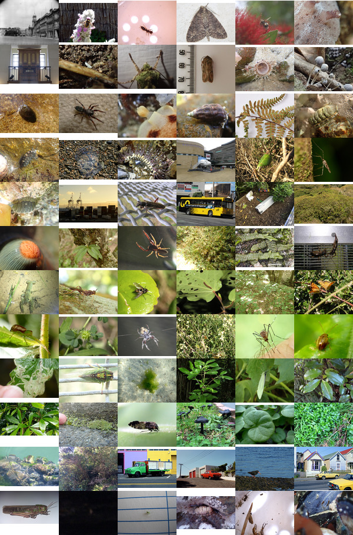

# dutiful-data

Our GovHack2017 goal was to use data in a way that's playful, accessible, and beautiful.

### The Data

We browsed several available datasets, and also pulled Wellington-related information from Twitter. In the end, we decided to use the following data sources:

* Photographs from [DigitalNZ.org](https://www.digitalnz.org) that are geotagged in the Wellington region (sourced via the [DigitalNZ API](https://www.digitalnz.org/developers))
* Stamps from the Te Papa Museum collection (also acquired via the DigitalNZ API)
* Official Information Act requests from [FYI.org.nz](https://fyi.org.nz/) (acquired via web scraping)

### The Result 

We decided to combine these materials in a creative and unexpected way: by making postcards.

In our Web App, **[hackviz.tech](http://hackviz.tech)**, you can find a randomly generated postcard combining the beauty of Open Government Data and our wonderful Wellington city!

### Images

Andd ere's a selection of the Wellington images that we used to create our postcards.

